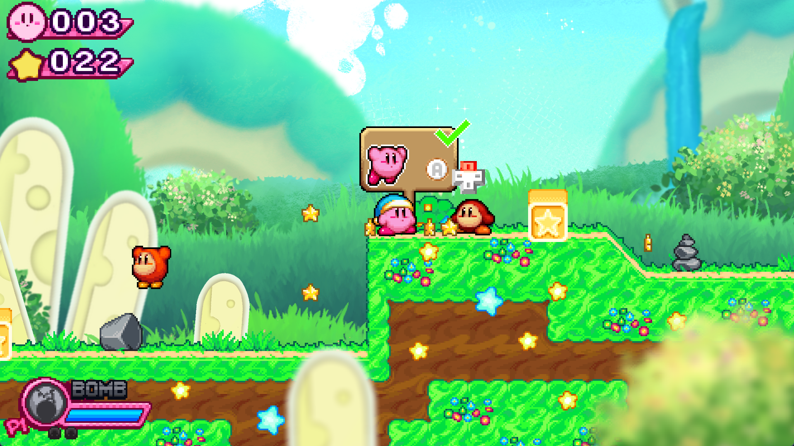
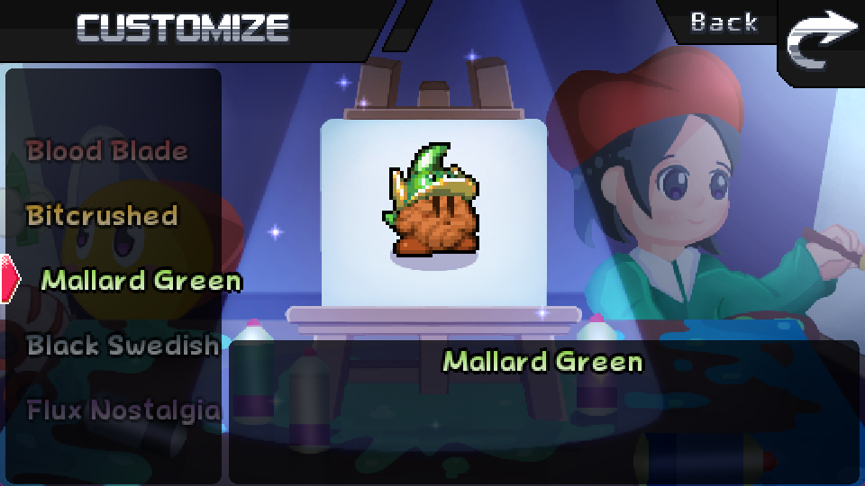
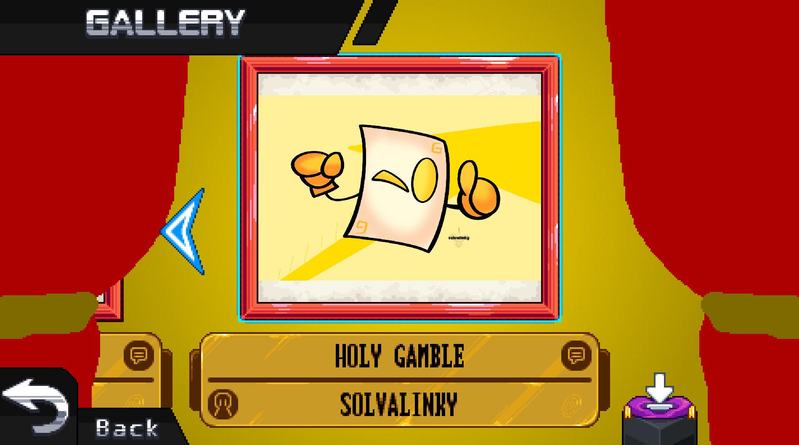
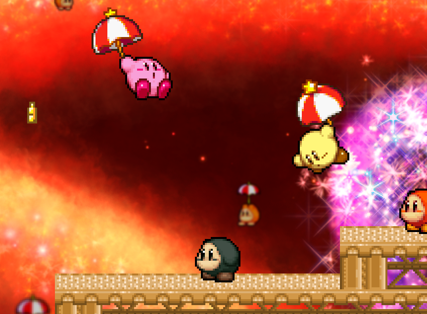

# Kirby Gamble Galaxy Stories 

Kirby Gamble Galaxy Stories is a fangame of HAL Laboratories' Kirby series. It is the most ambitious and biggest Kirby fangame in development with over 20 worlds, lots of Sub-Games, and 30+ abilities, including Super Abilities and the newly introduced Mystic Abilities. Go through various planets and learn Gamble's mystery and the impending doom that awaits...

## Built With

Game Maker (Studio 2)

## Contributing

Anyone's free to make pull requests. Make sure to properly tag your commits and open issues first if you can.

**Please credit MegaStrimp and Team Gamble if you use parts of the code in your own projects!**

## Legal

"Kirby Gamble Galaxy Stories" is an unofficial, non-profit art project made by the fans of Hal Laboratories' Kirby series. We do not accept donations in any way, shape or form. This project was just made for fun and no other greater goal.
Team Gamble does not take any financial gains from this project, and ads are disabled in every distribution place we're associated with; this includes the Kirby Gamble Galaxy Stories Youtube channel.
Please purchase the latest official Kirby games released by Hal Labs & Nintendo to support Kirby series.
To Nintendo; we are always open to suggestions & content we need to change in our project if needed. We are a team made of long-time Nintendo fans and support the company in anyway we can. We are doing this art project free of charge and with no goal of competition in mind.
All rights of Kirby characters, lore, music and other assets belong to Hal Labs & Nintendo.
